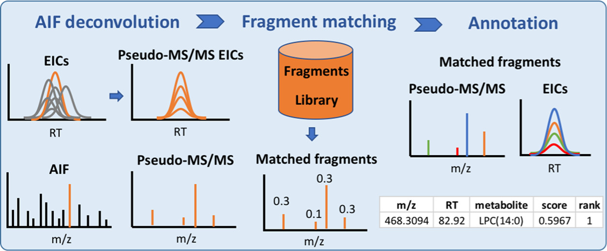

# MetaboAnnotatoR

## Description
This R package is designed to perform metabolite annotation of features from LC-MS All-ion fragmentation (AIF) datasets, using ion fragment databases.
It requires raw LC-MS AIF chromatograms acquired/transformed in centroid mode.



For more details on how the software works, further testing and performance please read the full publication in Analytical Chemistry journal: https://pubs.acs.org/doi/10.1021/acs.analchem.1c03032, 
and also try the package vignettes.

## Installation instructions

To install via Github, run the following code in R console:
```
install.packages("devtools", repos = "http://cran.us.r-project.org", dependencies = TRUE)

library(devtools)

install_github("gggraca/MetaboAnnotatoR", dependencies = TRUE)
```

## Installation issues

In some environments, some errors might occur durring installation due to some of the package dependencies, being the most common "mzR has been built against a different Rcpp version". This issue can be easily fixed as suggested [here](https://support.bioconductor.org/p/134630/). The following environment variable can be changed before installing using install_github:
```
Sys.setenv(R_REMOTES_NO_ERRORS_FROM_WARNINGS="true")
```

For installation error of the type "ERROR: loading failed for 'i386' ", try to add the -- no-multiarch , --no- lock statements:
```
install_github("gggraca/MetaboAnnotatoR", dependencies = TRUE, INSTALL_opts = c('--no-multiarch', '--no-lock'))
```

## Vignettes
Please check the vignettes folder for examples of package use:
- Introductory vignette: an example of feature annotation using LC-MS AIF chromatograms processed using xcms and RamClustR packages, as described in the MetaboAnnotatoR paper.
- Generation of Metabolite fragment database entry from MS/MS experimental spectra.
- Generation of Metabolite fragment database entry from MS/MS spectra from public databases (in .msp format).
